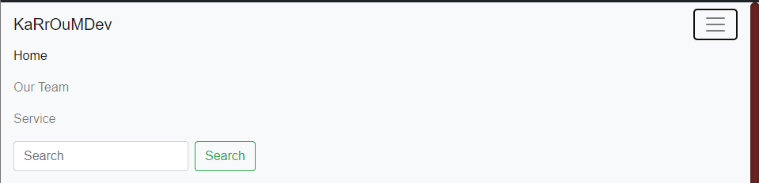
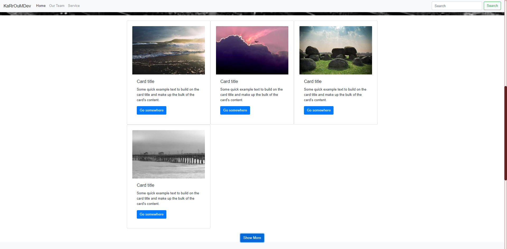
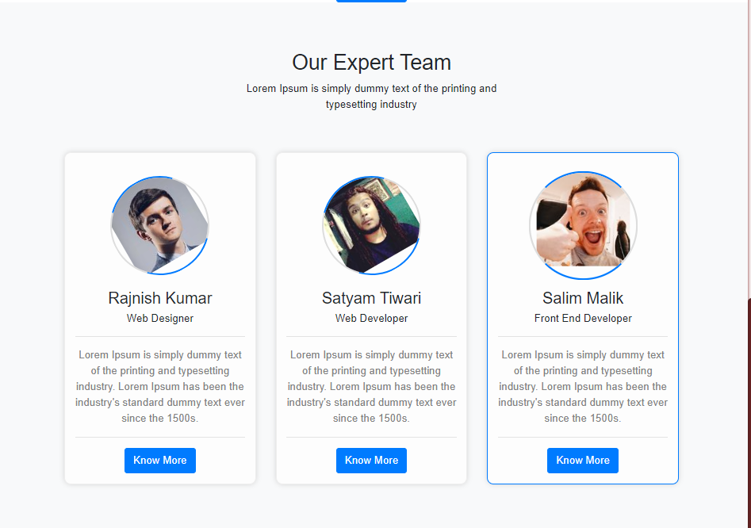
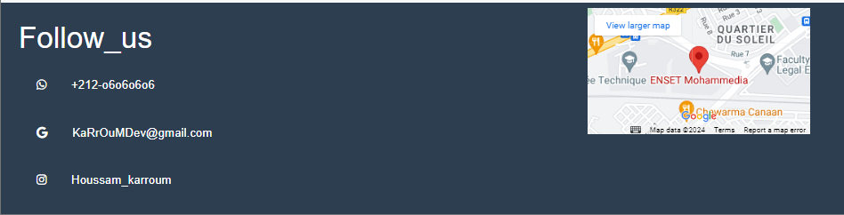

# Website README

This README explains the structure of My Bootstrap 4 website. It has 4 sections: Navbar, Carousel, Services, Our Team, and Footer.

## Sections

### Navbar

- Shows navigation links.
- 
### Carousel

- Displays rotating images or content.
- 

### Services

- Highlights services or features.
- 

### Our Team

- Introduces team members or contributors.
- 

### Footer

- Contains contact info and social media links.
- 

## How to Use

1. Clone this repo.
2. Customize content in `index.html`.
3. Adjust styles in `style.css`.
4. Test locally before deployment.

## Deployment

- Deploy to your hosting service once ready.

## Credits

- Built with Bootstrap 4.
